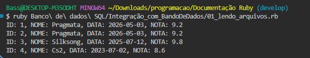
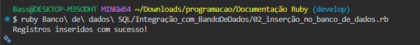
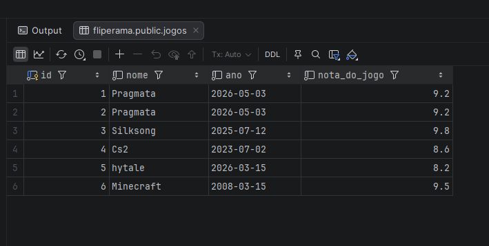
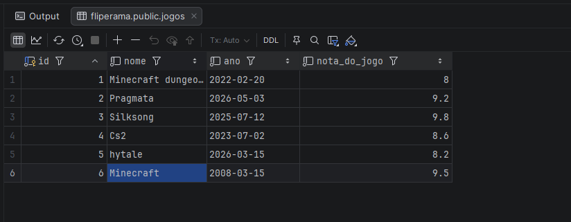
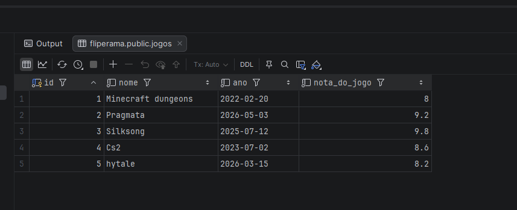
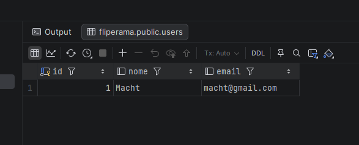

# Integração com Banco de dados ao Ruby

## índice

1. [Introdução conceitual](#introdução-conceitual-de-banco-de-dados)
2. [O que é o SQL](#o-que-é-sql)
3. [SGBDs](#importância-de-sgbds)
4. [Criando Banco e tabelas](#banco-e-tabelas)
5. [Inserindo dados em nossa tabela](#inserindo-dados-em-uma-tabela)
6. [Integração com banco de dados](#intregação-com-banco-de-dados")
7. [Inserindo dados em uma tabela via Ruby](#inserção-de-dados-via-ruby)
8. [Atualizando dados em uma tabela via Ruby](#atualizando-dados-de-uma-tabela-via-ruby)
9. [Removendo dados de uma tabela via Ruby](#removendo-dados-de-uma-tabela-via-ruby)
10. [O que é ORM](#o-que-é-orm)
11. [Utilizando ActiveRecord](#utilizando-activerecord)
12. [Praticando com ActiveRecord](#projeto-com-activerecord)
13. [O que NoSQL?](#o-que-é-nosql)

---

## Introdução conceitual de banco de dados

> A necessidade de ter um banco é para alocar os dados em algum lugar de fácil acesso, mantendo o mesmo seguro, já que antigamentoe por papel era comum perda de dados ou arquivos.

- Com já abordei mais do que o básico em [Modelagem de banco de dados](../Modelagem_BancoDeDados/README.md), aqui falarei de uma maneira mais breve e irei me aprofundar em assunto mais complexos como `ORM` por exemplo e integração do banco com a linguagem `Ruby`.

- Coleção de dados relacionados.

    - Uma coleção lógica e coerente de dados algum significado inerente.

    - Projetado, construído e povoado por dados com um propósito.

## O que é `SQL`?

> Linguagem de consulta estrutura, e é uma linguagem de consulta para os [`SGBDs`](#importância-de-sgbds) relacionais.

- Manipulação de dados(`DML`):

    - Inserir dados

    - Selecionar dados

    - Atualizar dados

    - Excluir dados

- Manipulação de dados(`DDL`):

    - Criar estrutura

    - Alterar estrutura

    - Remover estrutura

- Manipulação de dados(`DCL`):

    - Concede permissões

    - Revogar permissões

- Manipulção de dados(`DTL`):

    - Efetiva uma transação(`commit`)

    - Descarta uma transação(`rollback`)

## Importância de `SGBDs`

> O que é um `SGBD`? É um sistema de gestão de base de dados. Pacotes que utilizam o `SQL` para realizar consultas.

- Caterogias:

    - `SQL` - Relacional

    - `NoSQL` - Não Relacional

## Banco e tabelas

> Aqui irei fazer a crianção de um banco e algumas tabelas, sinta-se a vontade para selecionar o seu `SGBD`, escolhi o `postgres` e estou utilizando de `IDE` visual o `DataGrip`."

- Criação do banco:

    ```SQL

        CREATE DATABASE fliperama

    ```

- Criação da tabela:

    ```SQL

        CREATE TABLE jogos(
            id serial primary key,
            nome varchar(255) not null,
            ano date not null,
            nota_do_jogo double precision not null
        );

    ```

## Inserindo dados em uma tabela

> Novamente utilizei o `DataGrip` para inserir os dados e vamos utilizar um dos comandos `DML` do `SQL`.

- Iserindo dados:

    ```SQL

        INSERT INTO jogos(nome, ano, nota_do_jogo)
        VALUES(
            'Pragmata', '2026-05-03', 9.2
        ), (
            'Silksong', '2025-07-12', 9.8
        ), (
            'Cs2', '2023-07-02', 8.6
        );

    ```

## Integrão com banco de dados

> Aqui farei a integração do nosso `SGBD` com o `Ruby`, para começamos, crie um novo diretório para alocar o seu banco de dados, no meu caso irei alocar tudo em [Banco de dados SQL](/Banco%20de%20dados%20SQL/).

- Para conseguir trabalha com o `Ruby` e o `posgresSQL` e fazer nossa integração, precisamos utilizadr uma `gem` chamada `pg`. Irei utilizar o método de instalção em `gemfile`:

    ```bash

        gem 'pg', '~> 1.5', '>= 1.5.9'

    ```

    - Para que a gem funcione precisamos utilizar o comando `bundle`:

    ```bash

        bundle install gem_desejada

    ```
- Agora vamos ler nossos dados a partir de um arquivos `Ruby`.

    ```ruby

        require 'pg'

        conn = PG.connect(
        dbname: 'fliperama',
        user: 'postgres',
        password: '2319',
        host: 'localhost',
        port: 5432
        )

        # Consulta SQL

        query = 'SELECT * FROM jogos'

        begin

        result = conn.exec(query)

        #Itera as linhas do resultado

        result.each do |row|
            puts "ID: #{row['id']}, NOME: #{row['nome']}, DATA: #{row['ano']}, NOTA: #{row['nota_do_jogo']}"
        end

        ensure

        conn.close if conn

        end

    ```

    > Bem, aqui utilizei o `require 'pg'` para importa a `gem`, utilizei o `conn` para ser a variável que guarda a conexão com o banco. Utilizei o `query` para usar como consulta que foi o `SELECT * FROM jogos`. 

    > Iniciei um block com `begin` para caso a coneão de erro, após isso utilizei outra váriavel para guarda o resultado da `query`, que foi `result = con.exec(query)`. Nisso iniciei um block de repetição com `each` para ler os dados a partir da nossa váriavel `result` e formatei para fica algo mais apresentável. Finalizei com `ensure` para fecha o bloco `begin` e adicionei uma condição SE a conexão estiver eu a fecho com um `conn.close if conn`. Ou seja, se a conexão estiver ativa e para finaliza-lá.
    
    - Resultado:

        

## Inserção de dados via Ruby

> Aqui irei aborda como inserir dados em nosso banco a partir da lingaugem `Ruby`.

- Código:

    ```ruby

        require 'pg'

        # conexão com o BD

        conn = PG.connect(
        dbname: 'fliperama',
        user: 'postgres',
        password: '2319',
        host: 'localhost',
        port: 5432
        )


        # adcionando dados com um array

        registros = [
        {nome: 'hytale', ano: '2026-03-15', nota_do_jogo: 8.2},
        {nome: 'Minecraft', ano: '2008-03-15', nota_do_jogo: 9.5},
        ]

        # interando os dados do array

        registros.each do |registros|

            nome = registros[:nome]
            ano = registros[:ano]
            nota_do_jogo = registros[:nota_do_jogo]

            # instrução SQL para inserção
            
            insert_query = "INSERT INTO jogos(nome, ano, nota_do_jogo) VALUES('#{nome}', '#{ano}', #{nota_do_jogo})"

            conn.exec(insert_query)

        end

        puts "Registros inseridos com sucesso!"

        conn.close

    ```

    - Aqui utilizei o `array` composto por um `hahs` para guarda as inserções, utilzei o `registros` para guarda os dados e dentro do mesmo usei os pâremotros idêntico as colunas que se encontram em nosso banco `nome`, `ano` e `nota_do_jogo`.

    - A abordagem que utilizei para inserir todos os dados foi usar um `each` em nosso array `registros` para percorrer e fazer a inserções quantas vezes for preciso(foram apenas 2 dados inseridos). 

    - Criei outra variável para ser nossa query que foi `insert_query` e passei o comando do banco para inserção `INSERT INTO`, após a inserção com nosso `conn.exec(insert_query)` fechei a conexão com o bacndo atráves do `conn.close` pré fechamento adicionei um `puts` para avisar que tudo foi registrado com sucesso.

    - Resultado:

        > Resultado 1
        
        

        > Resultado 2

        

        - Os dados dentro no nosso banco.

## Atualizando dados de uma tabela via `Ruby`

> Aqui irei aborda como fazer um `UPDATE` no banco via `Ruby`, de uma forma simples e clara! Óbvio que você está livre para personalizar do jeito que deseja, como uma entra com `get.chomp`, seguindo a ordem do banco, como `varchar`, `int` ou `date`.

- Código:

    ```ruby

        require 'pg'

        # conexão com o BD

        conn = PG.connect(
        dbname: 'fliperama',
        user: 'postgres',
        password: '2319',
        host: 'localhost',
        port: 5432
        )

        # Update via id 

        id_registro = 1

        # passando parâmetros para atualização 

        new_name = 'Minecraft dungeons'
        new_year = '2022-02-20'
        new_ratting = 8.0


        # instrução SQL de Update

        update_query = "UPDATE jogos SET nome='#{new_name}', ano='#{new_year}', nota_do_jogo=#{new_ratting} WHERE id=#{id_registro}"

        conn.exec(update_query)

        puts "A query foi execultado com sucesso!"

        puts "<===========================================>"

        print update_query

        conn.close

    ```

    - Observa-se que utilizei a variável `id_registro` para alocar o `id` que desejo fazer o `UPDATE`. Fiz o mesmo esquema com `new_name`, `new_year` e `new_ratting`. Lemrbando que irei interpolar essas `strings` correspondendo as colunas de nosso banco.

    - utilizei a variável `update_query` para inserir nosso comando `UPDATE` e fiz referência a nossa tabela `jogos` após passei os parâmetro correspondentes como ` nome='#{new_name}'`, `ano='#{new_year}'` e `nota_do_jogo=#{new_ratting}`. Além disso utilizei a cláusula `WHERE` para passar que o `UPDATE` aconteca apenas com quem possui o `id=#{id_registro}`, que nossa caso é o `id=1`.

        - Resultado:

            

## Removendo dados de uma tabela via `Ruby`

> Aqui irei fazer algo simples, como excluir dados do banco via `Ruby`, é até mais simples que fazer `UPDATE`.

- Código:

    ```ruby

        require 'pg'

        # conexão com o BD

        conn = PG.connect(
        dbname: 'fliperama',
        user: 'postgres',
        password: '2319',
        host: 'localhost',
        port: 5432
        )

        # Delete via id

        id_exclusão = 6

        # instruções SQL Delete

        delete_query = "DELETE FROM jogos WHERE id=#{id_exclusão}"

        conn.exec(delete_query)

        puts "A query foi execultado com sucesso"

        puts "<=========================================================================>"

        print delete_query

        conn.close

    ```

    - Usei o método de guarda meu `id` em uma váriavel, que foi o `id_exclusão` para passar futuramente em nossa query.

    - Em nossa query utilizei uma várivel para guarda o comando que foi `delete_query` e passei as instruções `SQL` coomo a tabela desejado e utilizei a cláusula `WHERE` para que todo o `id=#{id_exclusão}` seja apagado.

        - Resultado:

            

## O que é `ORM`?

> Primeiramente qual o significado de `ORM` que é `MAPEAMENTO OBJETO RELACIONAL`. Devemos entender o porque precisamos utilizar um `ORM`.

- Motivo de utilizar `ORM`:

    > Para apróximar a comunicação do `POO` com banco de dados relacionado(`SQL`) e o mapeamento entre estruturas `POO` e banco de dados relacional(`SQL`). Essa abordabem é a técnica que une `POO` com `SQL`.

    > A ideia é que uma classe se torne uma tabela e os atributos se tornem colunas. Por meio do `ORM` podemos remover instruções `SQL`.


## Utilizando `ActiveRecord`

> Aqui vamos utilizar um `ORM` mais famoso do `Ruby` que é o `ActiveRecord`, para instalção do mesmo é necessário utilizar uma `Gem`, utilizei via `gemfile`:

- `Gem`

    ```bash

        gem 'activerecord-import', '~> 0.15.0'

    ```

    - Após adicionar o aqui em meu `gemfile` execulto o comanndo `bundle install` dentro do diretório da minha `gemfile`.


> Irei criar um exemplo de como utilizar o `ActiveRecode` via `Ruby` com a integração do banco de dados para apróximar `POO` com `SQL`, tudo isso graças ao `ORM`.

- Código:

    ```ruby

        require 'active_record'

        # Configuração do BD

        ActiveRecord::Base.establish_connection(
        adapter: 'postgresql',
        host: 'localhost',
        username: 'postgres',
        password: '2319',
        database: 'fliperama'
        )

        # Criação de uma tabela 

        ActiveRecord::Schema.define do
            create_table :users do |t|
            t.string :nome
            t.string :email
            end
        end

        # Definição de um modelo

        class User < ActiveRecord::Base
            
        end

        user = User.new(nome: 'Macht', email: 'macht@gmail.com') # Equivalente ao INSERT INTO users(nome, email)
        user.save

        # Recuperando os dados

        users = User.all # Equivalente ao SELECT * FROM users
        users.each do |user|
        puts "Nome: #{user.nome}, E-mail: #{user.email}"
        end

    ```

    - Oberva-se que para fazer a conexão com banco via `ActiveRecord` é bem diferente do `pg`. Para conectar via `ActiveRecord` utilizamos o `ActiveRecord::Base.esteblish_connection` e os parâmetros de nosso banco de dados. 

    - Para criação de tabela via `ActiveRecord` utilizamos o `ActiveRecord::Schema.define` e criamos um loop onde vamos definir nossa nova tabela `create_table :users` e suas linhas que foram `t.string :nome` e `t.string :email`.

    - Após isso definimos o modelo importante a base do nosso `ORM` via herança para a nossa `Classe` que vai guarda nosso dados, que em nosso caso foi `User`. Após passar nossa `Classe` para uma variável para ser reutilizada, usamos um `user.save` para que os dados sejam salvos em nossa váriavel.

    - Irei recuperar os dados usando um loop, em criei uma nova váriavel chamada `users` e atribui o `User.all`(que é equivalente a um `SELECT * FROM users`) para consulta uma tabela via `ActiveRecord`. Usei um `users.each` para exibir os dados de nossa tabela `Users`.

    - Resultado:

        

> Detalhe, se você quiser utilizar o `ORM` com outro `SGBD` é necessário fazer a instalção de sua `gem` equivalente e só dps utilizar o `ActiveRecord` para fazer a conexão.

## Projeto com ActiveRecord

> Irei criar um sistema de estoque utilizando o `ActiveRecord`, já que a partir do mesmo podemos criar tabelas e linhas, diferente de só consumir a gem `pg` que só podemos usar `DDL` e `DML`.

- Como pe um projeto relativamente grande, irei separar as parte do mesmo e explicar de uma forma mais clara.

- Código:

    ```ruby

        require 'active_record'

        ActiveRecord::Base.establish_connection(
        adapter: 'postgresql',
        host: 'localhost',
        username: 'postgres',
        password: '2319',
        database: 'estoque'
        )

    ```

    > Aqui importamos o `ActiveRecord` e utilizamos o mesmo para estabelecer uma conexão com nosso banco de dados.

    ---

    ```ruby

        ActiveRecord::Schema.define do
            create_table :categories do |t|
            t.string :name
            end

            create_table :products do |t|
            t.string :name
            t.integer :category_id
            t.integer :stock_amount, default: 0
            end
        end

    ```

    > Criando as tabelas e as colunas com o `ActiveRecord`, a primeira tabela temos apenas a coluna `name` que é do tipo `string(varchar)` mas para criação dos mesmo e necessário iniciamos um loop. Na segunda tabela seguimos a mesma lógica no entando temos duas colunas com o tipo `integer` e a coluna `stock_amount` foi difinida como padrão inicializar como `0`.

    ---

    ```ruby

        class Category < ActiveRecord::Base
            has_many :products
        end

        class Product < ActiveRecord::Base
            belongs_to :category

            def descrease_stock(amount)
                if self.stock_amount >= amount
                self.stock_amount -= amount
                self.save
                else
                puts "não há estoque!"
                end
            end

            def increase_stock(amount)
                self.stock_amount += amount
                self.save
            end
        end

    ```

    > Em nossa `classe/tabela Category` herdamos a base do `ActiveRecord` e definimos um relacionamento de `1:N` ou um para muitos. Seguindo a mesma linda em nossa `classe/tabela Products` herdamos a base do `ActiveRecord` e definimos um relacionamento de `1:N`, e falamos que essa `classe` é dependente de quem possuí o `has_many`, utilizando o `belong_to` assim criando o relacionamento de chave estrangeira. Aqui mesmo dentro de nossa `classe` vamos criar um sistema acrescentar de dimunuir estoque da loja atráves do método `descrease_stock` para decrementar e `increase_stock` para incrementar.

    ---

    ```ruby

        category = Category.create(name: 'Eletrônicos')

        product1 = category.products.create(name: 'phone', stock_amount: 10)
        product2 = category.products.create(name: 'notebook', stock_amount: 5)

        product1.descrease_stock(3)
        product2.increase_stock(10)

        all_products = Product.all

        all_products.each do |p|
        puts "Nome: #{p.name}, Cateogria #{p.category.name}, Estoque: #{p.stock_amount}"
        end

    ```

    > Utilizando as `classes` e nossas tabelas, em `category` utilizei uma variável para guarda nossa `classe` e criar nossa coluna em nosso banco via `ORM` após isso fiz o mesmo processo para guarda o nomes dos protudos e a quantidade em estoque. Feito isso, criei uma variável para listar tudo com o `.all` que é básicamente um `SELECT * FROM`, fiz isso em um bloco loop para lista todos os dados formatados.

## O que é `NoSQL`?

> O que é o `NoSQL`? Aqui é um novo modo de se utilizar o banco de dados mas não da maneira relacional, ou seja, com tabelas colunas e linhas. Isso acontece porque não temos uma estruturas prévias para os tipo de dados que serão recebido mas a vantagem do `NoSQL` é sua velocidade, flexibilidade e escalabilidade.