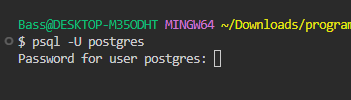
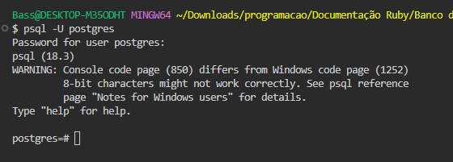
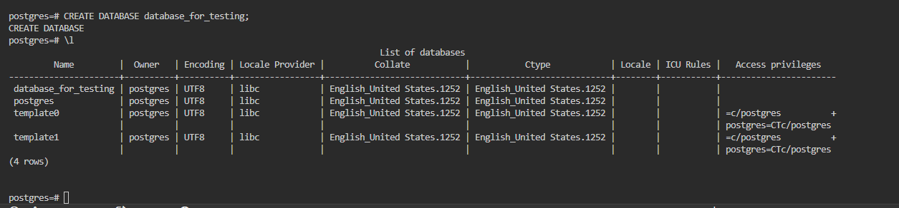
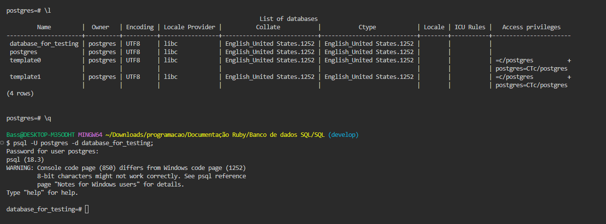
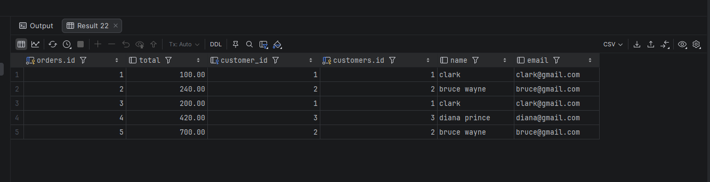
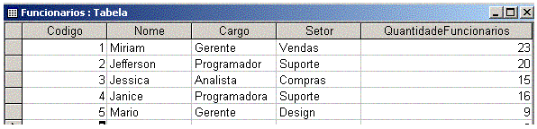
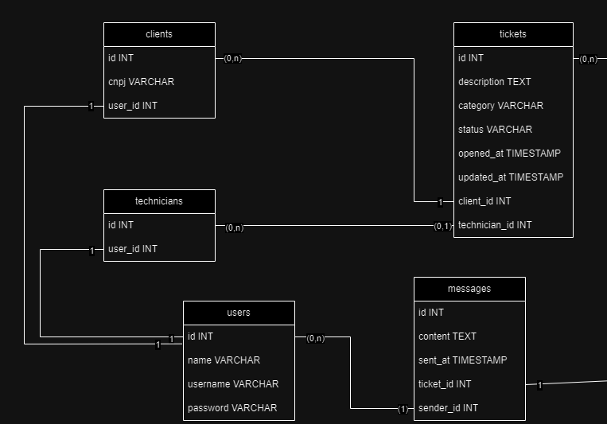
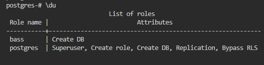

# Modelagem de Banco de Dados

## Índice

1. [Introdução conceitual](#introdução-ao-conceito-de-bancos-de-dados)
2. [Fundamentos sobre SQL](#fundamentos-de-banco-de-dados-sql)
3. [Conhecendo a linguagem SQL](#conhecendo-a-linguagem-sql)
4. [Tipos de dados](#tipos-de-dados)
5. [PSQL via CLI](#comando-do-banco-via-cli)
6. [Inserindo linhas em uma tabela](#inserindo-linhas-em-uma-tabela)
7. [Consultar dados de uma tabela](#consultando-dado-de-uma-tabela)
8. [Comandos avançados de consulta](#comandos-avançados-de-consulta)
9. [Atualização e exclusão de linhas](#atualização-e-exclusão-de-linhas)
10. [Backup e restauração](#backup-e-restauração)
11. [Relacionamentos entre tabelas](#relacionamentos-entre-tabelas)
12. [Relacionamentos 1:1, 1:n, JOIN e n:n](#relacionamentos-11-1n-e-nn)
13. [Integridade Referencial](#integridade-referencial)
14. [Encadeamento de consultas com JOIN](#encadeamento-de-consulta-com-join)
15. [Modelagem de banco de dados](#modelagem-de-banco-de-dados-1)
16. [Normalização de banco de dados](#normalização-banco-de-dados)
17. [Modelando um banco de dados](#modelando-um-banco-de-dados)
18. [Gerênciamento de usuários](#gerênciamento-de-usuários)
19. [Projeto de banco de dados](#projeto-de-banco-de-dados)
20. [Constraints](#constraints)
21. [Joins](#joins)
22. [Functions](#functions)

---

## Introdução ao conceito de Bancos de Dados

> Bancos de dados são a espinha dorsal de qualquer aplicação moderna — de sistemas web a aplicativos mobile, quase tudo persiste dados em algum lugar.

- São um conjunto de arquivos relacionados entre si que armazenam todo tipo de dados (sobre pessoas, usuários, objetos, etc).

- No começo, eram gerenciados pelo próprio sistema de arquivos e `SOs`, até que surgiram os `SGBDs` (Sistema de Gerenciamento de Banco de Dados).

    - Um `SGBD` é um software encarregado de cuidar do acesso, persistência, manipulação e organização dos dados.

    - Um `SGBD` (do inglês, `DBMS`) é o que hoje chamamos informalmente de "banco de dados" — mas ele não é o banco de dados em si. O `SGBD` inclui o banco de dados, mas pode incluir várias outras ferramentas em seu ecossistema.

    - Exemplos de `SGBDs` conhecidos: `PostgreSQL`, `SQL Server`, `MySQL`, `MariaDB`, `Oracle`, `Firebird`, `MongoDB`.

### Categorias de Bancos de Dados

- **Relacionais ou SQL:** bancos mais tradicionais que trabalham com uma linguagem de consulta estruturada padrão (`SQL`).

- **Não-relacionais ou NoSQL:** bancos mais modernos que se popularizaram a partir da década de 2010 para solução de diversos problemas específicos, não utilizando os conceitos tradicionais e a linguagem `SQL`.

---

## Fundamentos de Banco de Dados SQL

> Antes de escrever qualquer query, é essencial entender os blocos fundamentais que compõem um banco de dados relacional.

- **Tabelas:** forma estruturada de armazenar os dados. Um banco de dados é composto de várias tabelas (relacionadas ou não).

- **Relacionamentos:** formas de vincular uma tabela a outra para criar estruturas mais robustas e coesas.

- **Colunas:** definem quais dados podem ser inseridos em uma tabela — equivalem aos campos de um formulário.

- **Linhas:** são os registros de dados em si. Cada linha é considerada uma entrada individual em uma tabela.

- **Chave primária:** a coluna de uma tabela que é única e serve para identificar cada linha sem ambiguidade.

- **Constraints:** limitações e regras impostas sobre o banco de dados para garantir a integridade dos dados.

---

## Conhecendo a linguagem SQL

### O que é SQL?

> `SQL` (Structured Query Language) foi criada na década de 1970 pela `IBM` e posteriormente padronizada pela `ANSI` e `ISO`. É a linguagem padrão utilizada para gerenciar e manipular bancos de dados relacionais — presente em praticamente toda aplicação web.

- Serve para criação de tabelas, inserção de linhas, consulta e manipulação dos dados, gerenciamento de acesso, etc.

```sql
CREATE TABLE clientes;

SELECT nome, telefone FROM clientes;
```

---

### Categorias de comandos da linguagem SQL

- **DDL** (Data Definition Language) — comandos para **definir a estrutura** do banco:

    ```sql
    CREATE TABLE,
    ALTER TABLE,
    DROP TABLE
    ```

- **DML** (Data Manipulation Language) — comandos para **manipular dados**:

    ```sql
    SELECT,
    INSERT,
    UPDATE,
    DELETE
    ```

- **DCL** (Data Control Language) — comandos para **controlar o acesso** aos dados:

    ```sql
    GRANT,
    REVOKE
    ```

- **TCL** (Transaction Control Language) — comandos para **gerenciar transações**:

    ```sql
    BEGIN,
    COMMIT,
    ROLLBACK
    ```

---

## Tipos de dados

> Tipos de dados definem a natureza dos valores que podem ser armazenados em uma coluna. Escolher o tipo adequado é crucial para a eficiência, integridade e otimização do banco.

### Dados numéricos

| Tipo              | Descrição                                               |
|-------------------|---------------------------------------------------------|
| `SMALLINT`        | Inteiro de 2 bytes                                      |
| `INT / INTEGER`   | Inteiro de 4 bytes                                      |
| `BIGINT`          | Inteiro de 8 bytes                                      |
| `FLOAT`           | Número com ponto flutuante de precisão simples          |
| `DOUBLE`          | Número com ponto flutuante de precisão dupla            |
| `DECIMAL/NUMERIC` | Precisão fixa — ideal para valores monetários           |

### Dados de texto

| Tipo          | Descrição                                     |
|---------------|-----------------------------------------------|
| `CHAR(n)`     | Cadeia de caracteres de comprimento fixo      |
| `VARCHAR(n)`  | Cadeia de caracteres de comprimento variável  |
| `TEXT`        | Cadeia de caracteres de comprimento muito grande |

### Dados de data e hora

| Tipo        | Descrição                                    |
|-------------|----------------------------------------------|
| `DATE`      | Data (ano, mês, dia)                         |
| `TIME`      | Hora (hora, minuto, segundo)                 |
| `DATETIME`  | Combinação de data e hora                    |
| `TIMESTAMP` | Data e hora — muito usado para metadados     |

### Outros tipos

| Tipo      | Descrição                                                          |
|-----------|--------------------------------------------------------------------|
| `BOOLEAN` | Valores lógicos (`TRUE` ou `FALSE`)                                |
| `BLOB`    | Dados binários grandes — para armazenar imagens, vídeos (pouco usado) |
| `ENUM`    | Conjuntos de valores predefinidos                                  |
| `JSON`    | Armazena dados em formato JSON                                     |

---

## Comando do banco via CLI

> Normalmente utilizamos algum recurso visual para manipular o `SGBD` — como `DataGrip`, `PHPmyAdmin` ou `PGAdmin` — porém aqui utilizaremos diretamente via `CLI` (interface de linha de comando).

**Inicializando o PostgreSQL:**

```sql
psql -U postgres
```



> Após o comando, digite a senha que você definiu na instalação.



> Você já está dentro do servidor do banco. Agora basta criar um banco com o comando:

```sql
CREATE DATABASE nome-do-banco;
```

**Listar todos os bancos existentes:**

```psql
\l
```



> Observa-se que ele lista todos os bancos presentes no servidor.

---

### Logar em outro banco via CLI

**Deslogar do banco atual:**

```psql
\q
```

**Logar diretamente em um banco específico:**

```psql
psql -U postgres -d nome-do-banco;
```



**Trocar de banco rapidamente sem sair:**

```psql
\c nome-do-banco;
```

---

### Alterando nome do banco via CLI

```sql
ALTER DATABASE nome-do-banco RENAME TO novo-nome;
```

---

### Excluindo banco de dados via CLI

```sql
DROP DATABASE nome-do-banco;
```

---

### Criando uma tabela no banco

```sql
CREATE TABLE nome-da-tabela(
    id SERIAL PRIMARY KEY,
    name VARCHAR(255) NOT NULL,
    phone VARCHAR(20) NOT NULL,
    email VARCHAR(100) UNIQUE
);
```

> - `NOT NULL` — a coluna não pode ser vazia.
> - `SERIAL` — cria um auto-incremento automático para o `id`.
> - `UNIQUE` — garante que o valor do campo `email` seja único na tabela.

**Listar tabelas existentes:**

```psql
\dt
```

**Excluir uma tabela:**

```sql
DROP TABLE nome-da-tabela-que-deseja-excluir;
```

---

### Modificando uma tabela existente

**Adicionar uma nova coluna:**

```sql
ALTER TABLE nome-da-tabela ADD COLUMN nova-coluna TIPO-DA-NOVA-COLUNA;
```

**Excluir uma coluna existente:**

```sql
ALTER TABLE nome-da-tabela DROP COLUMN nome-da-coluna;
```

**Definir uma coluna como NOT NULL:**

```sql
ALTER TABLE nome-da-tabela ALTER COLUMN coluna-desejada SET NOT NULL;
```

**Remover o NOT NULL de uma coluna:**

```sql
ALTER TABLE nome-da-tabela ALTER COLUMN coluna-desejada DROP NOT NULL;
```

**Renomear uma coluna:**

```sql
ALTER TABLE nome-da-tabela RENAME COLUMN coluna-desejada TO novo-nome-da-coluna;
```

**Criar uma coluna somente se ela não existir:**

```sql
ALTER TABLE nome-da-tabela ADD COLUMN IF NOT EXISTS nome-da-coluna tipo-de-dado;
```

> O `IF NOT EXISTS` garante que, se já houver uma coluna com esse nome, a operação não será executada — evitando erros.

---

## Inserindo linhas em uma tabela

> O `INSERT INTO` é o comando usado para adicionar novos registros em uma tabela existente.

```sql
INSERT INTO nome-da-tabela(name, address, phone) VALUES(
    'bass', 'rua A, n380', '(84)98160-5893'
);
```

> - `INSERT INTO` — indica que queremos inserir algo e referencia a tabela de destino.
> - As colunas são listadas entre parênteses após o nome da tabela.
> - `VALUES` — os dados a inserir, **na mesma ordem** das colunas declaradas.

---

## Consultando dado de uma tabela

> O `SELECT` é o comando mais utilizado no SQL — responsável por buscar e exibir dados de uma ou mais tabelas.

```sql
-- Selecionar colunas específicas
SELECT coluna1, coluna2 FROM nome-da-tabela;

-- Selecionar todas as colunas
SELECT * FROM nome-da-tabela;
```

> O `*` seleciona todas as colunas da tabela. Para selecionar colunas específicas, separe-as por vírgula. O `FROM` aponta para qual tabela a consulta será feita.

---

### Utilizando `WHERE`, `AS`, `AND`, `OR` e `IN`

**`WHERE` — filtrar registros (equivalente a um `if`):**

```sql
SELECT * FROM nome-da-tabela WHERE coluna-desejada <condição>;

SELECT * FROM stock WHERE quantity < 20;
```

> Aqui utilizei o `WHERE` para buscar todos os produtos com quantidade menor que 20 na tabela `stock`.

---

**`AS` — renomear colunas temporariamente na consulta:**

```sql
SELECT nome-da-coluna AS novo-nome, nome-da-coluna AS novo-nome FROM nome-da-tabela;

SELECT id AS identificação, name AS nome FROM clients;
```

> O alias criado com `AS` existe apenas naquela consulta — diferente do `RENAME`, não altera o banco.

---

**`AND` — ambas as condições precisam ser verdadeiras:**

```sql
SELECT * FROM nome-da-tabela WHERE condição1 AND condição2;

SELECT * FROM stock WHERE category = 'grãos' AND amount < 20;
```

---

**`OR` — apenas uma das condições precisa ser verdadeira:**

```sql
SELECT * FROM nome-da-tabela WHERE condição1 OR condição2;

SELECT * FROM stock WHERE category = 'massas' OR amount = 100;
```

> Aqui utilizei o `OR` para verificar se existe uma categoria chamada `massas` **ou** algum item com quantidade 100.

---

**`IN` — verificar se o valor pertence a uma lista:**

```sql
SELECT * FROM nome-da-tabela WHERE coluna IN ('valor1', 'valor2');

SELECT * FROM stock WHERE category IN ('massas', 'grãos');
```

> O `IN` verifica se o valor de `category` é `massas` ou `grãos` — equivalente a múltiplos `OR` encadeados, mas mais legível.

---

## Comandos avançados de consulta

### Ordenação com `ORDER BY`

> Ordena os resultados da consulta de acordo com a coluna especificada.

```sql
SELECT * FROM tabela-desejada ORDER BY coluna-desejada;

SELECT * FROM clients ORDER BY name;
```

> Aqui filtrei por `name` — resultados em ordem alfabética.

**Crescente com `ASC`:**

```sql
SELECT * FROM tabela-desejada ORDER BY coluna-desejada ASC;

SELECT * FROM clients ORDER BY id ASC;
```

> Do menor `id` para o maior.

**Decrescente com `DESC`:**

```sql
SELECT * FROM tabela-desejada ORDER BY coluna-desejada DESC;

SELECT * FROM clients ORDER BY id DESC;
```

> Do maior `id` para o menor.

---

### Limitando resultados com `LIMIT` e `OFFSET`

**`LIMIT` — limita a quantidade de resultados:**

```sql
SELECT * FROM tabela-desejada LIMIT quantidade-desejada;

SELECT * FROM clients LIMIT 5;
```

> Retorna apenas os 5 primeiros registros.

**`OFFSET` — pula uma quantidade de registros (usado para paginação):**

```sql
SELECT * FROM tabela-desejada LIMIT 4 OFFSET 4;
```

> Pula os primeiros 4 registros e retorna os próximos 4. Combinado com `LIMIT`, cria um mecanismo de paginação.

---

### Funções de agregação: `COUNT`, `SUM` e `AVG`

**`COUNT` — conta a quantidade de registros:**

```sql
SELECT COUNT(coluna-desejada) AS nome-desejado FROM tabela;

SELECT COUNT(id) AS usuarios FROM clients;
```

> Conta quantos `id` existem e renomeia o resultado com `AS`.

**`SUM` — soma os valores de uma coluna:**

```sql
SELECT SUM(coluna-desejada) AS nome-desejado FROM tabela;

SELECT SUM(amount) AS total FROM stock;
```

> Soma o total de itens da coluna `amount` e renomeia como `total`.

**`AVG` — calcula a média aritmética:**

```sql
SELECT AVG(coluna-desejada) AS nome-desejado FROM tabela;

SELECT AVG(amount) AS media FROM stock_ingredients;
```

> Calcula a média dos valores da coluna `amount` e renomeia como `media`.

---

### Filtros avançados com `LIKE`, `%` e `_`

> O `LIKE` é sempre combinado com `WHERE` e permite buscas por padrões dentro de strings. O `%` representa qualquer sequência de caracteres, e o `_` representa um único caractere qualquer.

**`LIKE 'B%'` — começa com a letra B:**

```sql
SELECT * FROM tabela WHERE coluna LIKE 'b%';

SELECT * FROM clients WHERE name LIKE 'b%';
```

**`LIKE '_A%'` — tem A como segunda letra:**

```sql
SELECT * FROM tabela WHERE coluna LIKE '_a%';

SELECT * FROM clients WHERE name LIKE '_a%';
```

**`LIKE '%D'` — termina com a letra D:**

```sql
SELECT * FROM tabela WHERE coluna LIKE '%d';

SELECT * FROM clients WHERE name LIKE '%d';
```

**`LIKE '%AN%'` — contém AN em qualquer posição:**

```sql
SELECT * FROM tabela WHERE coluna LIKE '%an%';

SELECT * FROM clients WHERE name LIKE '%an%';
```

> Os dois `%` indicam que o trecho `an` pode aparecer em qualquer posição da string.

---

### `ILIKE` — busca case-insensitive

> Funciona como o `LIKE`, porém **não diferencia maiúsculas de minúsculas** — exclusivo do PostgreSQL.

```sql
SELECT * FROM tabela WHERE coluna ILIKE '%b%';

SELECT * FROM clients WHERE name ILIKE '%B%';
```

> Retorna tanto `Bass` quanto `bass`, `BASS`, etc.

---

## Atualização e exclusão de linhas

### `UPDATE` — atualizar dados de uma tabela

> O `UPDATE` modifica registros existentes. A cláusula `WHERE` é essencial — sem ela, **todos os registros da tabela serão atualizados**.

```sql
UPDATE nome-da-tabela SET coluna = 'novo-valor' WHERE condição;

UPDATE serie_tv SET situacao = 'Finalizada' WHERE situacao = 'Acabou';
```

> - `UPDATE` — indica qual tabela será atualizada.
> - `SET` — define qual coluna e qual o novo valor.
> - `WHERE` — filtra quais registros serão afetados.

**Atualizando múltiplas colunas ao mesmo tempo:**

```sql
UPDATE tabela SET coluna1='valor', coluna2='valor', coluna3='valor' WHERE condição;

UPDATE filmes SET titulo='Star Wars: A nova esperança', genero='Sci-fi/Fantasy' WHERE titulo='Star Wars';
```

> Múltiplas colunas são separadas por vírgula dentro do `SET`. O `WHERE` garante que apenas o filme com o título `Star Wars` seja afetado.

---

### `DELETE` — excluir registros de uma tabela

> O `DELETE` remove registros permanentemente. Assim como o `UPDATE`, sempre use com `WHERE` para evitar exclusões em massa acidentais.

```sql
DELETE FROM tabela-desejada WHERE condição;

DELETE FROM serie_tv WHERE titulo = 'The Office';
```

> Aqui excluímos apenas o registro onde `titulo` é igual a `The Office`.

---

## Backup e restauração

> Fazer backup regularmente é uma das práticas mais importantes em banco de dados — garante que os dados possam ser recuperados em caso de falha, acidente ou migração de servidor.

### Backup com `pg_dump`

```psql
pg_dump -U postgres -v -f "caminho/do/diretório/desejado/nome-do-backup" nome-do-banco
```

> - `-v` — verbose: exibe os detalhes do que está acontecendo.
> - `-f` — aponta o caminho e nome do arquivo de destino.

**Formatos disponíveis para o dump:**

| Flag   | Formato      | Descrição                       |
|--------|--------------|---------------------------------|
| `c`    | custom       | Formato binário comprimido      |
| `d`    | directory    | Diretório com arquivos separados|
| `t`    | tar          | Arquivo tar                     |
| `p`    | plain text   | SQL puro (padrão)               |

**Backup em formato customizado:**

```psql
pg_dump -U postgres -v -F c -f "caminho/do/diretório/desejado/nome-do-backup" nome-do-banco
```

**Backup de apenas uma tabela:**

```psql
pg_dump -U postgres -v -F c -f "caminho/do/diretório/desejado/nome-do-backup" -t nome-da-tabela nome-do-banco
```

> O `-t` referencia a tabela específica que será incluída no backup.

---

### Restauração

> **Importante:** o `pg_restore` só funciona com arquivos nos formatos `c`, `d` e `t`. Para arquivos `.sql` (formato `p`), use o `psql`.

**Restaurar com `pg_restore` (formatos custom, directory, tar):**

```psql
pg_restore --create -U postgres -v caminho/desejado/nome-do-banco.pgbackup
```

**Restaurar um arquivo `.sql` com `psql`:**

```psql
psql -U postgres -d nome_do_banco -f caminho/do/backup.sql
```

**Restaurar apenas uma tabela:**

```psql
pg_restore -U postgres -t nome-da-tabela -d nome-do-banco caminho/onde/está/o/banco
```

> - `-t` — informa que é uma tabela específica.
> - `-d` — indica o banco de destino.

---

## Relacionamentos entre tabelas

### O que são relacionamentos?

> Também chamados de associações, são formas de **vincular os dados de uma tabela aos dados de outra**, permitindo modelar relações do mundo real dentro do banco.

**Exemplo:**

- Temos duas tabelas: `clientes` e `endereços`. Um relacionamento entre elas permite associar uma linha da tabela `usuarios` a um endereço específico.

```sql
-- Usuario:
id: 312
nome: 'Bass'
email: 'bass123@gmail.com'
id_endereco: 9634

-- Endereço:
id: 9634
rua: 'Av. Presidente Vargas'
numero: '34'
id_usuario: 312
```

> Nos exemplos acima utilizamos o relacionamento `1:1` para ligar as tabelas `usuario` e `endereco` via `id_usuario` e `id_endereco`.

---

### Como funcionam os relacionamentos?

- **Chave primária (`Primary Key` / `PK`):** coluna ou conjunto de colunas que identificam unicamente cada linha de uma tabela.

- **Chave estrangeira (`Foreign Key` / `FK`):** coluna ou conjunto de colunas que estabelecem uma ligação entre duas tabelas.

---

### Os 3 tipos de relacionamento no SQL

| Tipo                   | Descrição                                                                               | Exemplo                                                            |
|------------------------|-----------------------------------------------------------------------------------------|--------------------------------------------------------------------|
| Um-para-Um (`1:1`)     | Cada linha de uma tabela está relacionada a no máximo uma linha de outra tabela         | Um usuário possui um endereço e um endereço pertence a um usuário  |
| Um-para-Muitos (`1:n`) | Cada linha de uma tabela pode estar relacionada a múltiplas linhas de outra tabela      | Um gênero pode ser usado em vários filmes                          |
| Muitos-para-Muitos (`n:n`) | Linhas de ambas as tabelas podem estar relacionadas entre si — usa tabela intermediária | Uma tag pode classificar vários posts e um post pode ter várias tags |

---

### Por que os relacionamentos são importantes?

- **Garantir integridade:** chaves estrangeiras evitam a inserção de dados órfãos ou inconsistentes — você não pode inserir um pedido para um cliente que não existe.

- **Evitar redundância:** a normalização divide os dados em tabelas relacionadas, onde cada informação é armazenada uma única vez. Atualizações em uma tabela se refletem automaticamente nas associações.

- **Consultas eficientes:** relacionamentos bem estruturados permitem `JOINs` eficientes para consultas complexas envolvendo múltiplas tabelas.

- **Modelagem intuitiva:** o modelo de dados reflete as relações do mundo real entre diferentes entidades.

- **Controle de acesso e segurança:** permissões podem ser definidas por tabela, protegendo dados sensíveis de acessos não autorizados.

---

## Relacionamentos 1:1, 1:n e n:n

### Criando o banco de exemplo

```sql
CREATE DATABASE relacionamentos;
```

---

### Relacionamento `1:1`

**Primeira tabela:**

```sql
CREATE TABLE employees(
    id SERIAL PRIMARY KEY,
    name VARCHAR(255),
    phone VARCHAR(30)
);
```

**Segunda tabela — com chave estrangeira:**

```sql
CREATE TABLE addresses(
    id SERIAL PRIMARY KEY,
    street VARCHAR(255) NOT NULL,
    number VARCHAR(10),
    complement VARCHAR(255),
    city VARCHAR(255) NOT NULL,

    employee_id INT UNIQUE,
    FOREIGN KEY(employee_id) REFERENCES employees(id)
);
```

> - `FOREIGN KEY` — declara a chave estrangeira.
> - `REFERENCES` — indica qual tabela e coluna serão referenciadas.
> - `UNIQUE` — garante o comportamento `1:1` (sem UNIQUE seria `1:n`).

---

### Relacionamento `1:n`

```sql
CREATE TABLE departaments(
    id SERIAL PRIMARY KEY,
    name VARCHAR(255) NOT NULL
);

ALTER TABLE employees ADD COLUMN departament_id INT;

ALTER TABLE employees ADD CONSTRAINT fk_departament
FOREIGN KEY(departament_id) REFERENCES departaments(id);
```

> - Primeiro adicionamos a coluna `departament_id` à tabela `employees`.
> - Depois criamos a constraint de chave estrangeira com um nome (`fk_departament`) — necessário ao alterar uma tabela existente.
> - A chave estrangeira fica na tabela `employees` porque ela é o lado "muitos" do relacionamento.

**Criando já com chave estrangeira (tabela do zero):**

```sql
CREATE TABLE employees(
    id SERIAL PRIMARY KEY,
    name VARCHAR(255) NOT NULL,
    phone VARCHAR(30),
    departament_id INT NOT NULL,

    FOREIGN KEY(departament_id) REFERENCES departaments(id)
);
```

> A diferença para o `1:1` é a ausência do `UNIQUE` — sem ele, vários funcionários podem pertencer ao mesmo departamento.

---

### Utilizando o `JOIN`

> O `JOIN` serve para fazer a junção de duas ou mais tabelas em uma única consulta, aproveitando as chaves estrangeiras como "ponte" entre elas.

```sql
SELECT * FROM employees JOIN addresses ON employees.id = addresses.employee_id;
```

> - `JOIN` — indica qual tabela será unida.
> - `ON` — define a condição de junção (qual coluna liga as duas tabelas).
> - `employees.id = addresses.employee_id` — o ponto referencia `tabela.coluna`.

**Selecionando colunas específicas com JOIN (evitando ambiguidade):**

```sql
SELECT
    employees.id AS ID,
    employees.name AS Funcionário,
    employees.phone AS Telefone,
    departaments.name AS Departamento
FROM employees JOIN departaments ON employees.departament_id = departaments.id;
```

> Quando duas tabelas têm colunas com o mesmo nome (como `id`), é necessário prefixar com `tabela.coluna` para evitar consultas ambíguas. O `AS` deixa o resultado mais legível.

---

### Relacionamento `n:n`

> Acontece quando os registros de uma tabela podem se relacionar com vários registros de outra tabela e vice-versa. É implementado com uma **tabela intermediária (ASSOCIATIVA)**.

**Criando as tabelas principais:**

```sql
CREATE TABLE students(
    id SERIAL PRIMARY KEY,
    name VARCHAR(255)
);

CREATE TABLE courses(
    id SERIAL PRIMARY KEY,
    name VARCHAR(255)
);
```

**Criando a tabela associativa:**

```sql
CREATE TABLE student_courses(
    student_id INT,
    course_id INT,

    PRIMARY KEY (student_id, course_id),
    FOREIGN KEY(student_id) REFERENCES students(id),
    FOREIGN KEY(course_id) REFERENCES courses(id)
);
```

> - A **chave primária composta** `(student_id, course_id)` garante que o mesmo aluno não seja inscrito no mesmo curso duas vezes — mas pode ser inscrito em vários cursos diferentes.
> - Duas chaves estrangeiras fazem a ligação com as tabelas `students` e `courses`.

**Inserindo dados na tabela associativa:**

```sql
INSERT INTO student_courses(student_id, course_id)
VALUES(1,1), (2,1), (3,1), (3,2);
```

> Aluno `id 1` no curso `id 1`, aluno `id 2` no curso `id 1`, aluno `id 3` no curso `id 1` e no curso `id 2`.

**Consultando com JOIN nas três tabelas:**

```sql
SELECT * FROM student_courses
JOIN students ON student_courses.student_id = students.id
JOIN courses ON student_courses.course_id = courses.id;
```

---

## Integridade Referencial

> Integridade referencial são regras que garantem que nosso banco seja **coeso e consistente** — sem dados "pendurados" ou referências inválidas entre tabelas.

- **Consistência de estado:** se o Dado A depende do Dado B, o sistema impede que o Dado B seja removido e deixe o Dado A como um "registro órfão".

- **Semântica dos dados:** sem chaves estrangeiras e restrições, números em uma coluna são apenas números. Com a integridade, esses números se tornam **referências com significado** — estabelecendo um contrato de confiança entre as tabelas.

---

### Exemplo prático de integridade referencial

```sql
CREATE TABLE customers(
    id SERIAL PRIMARY KEY,
    name VARCHAR(255) NOT NULL,
    email VARCHAR(100) UNIQUE NOT NULL
);

CREATE TABLE orders(
    id SERIAL PRIMARY KEY,
    total DECIMAL(10, 2),
    customer_id INT,
    FOREIGN KEY(customer_id) REFERENCES customers(id)
);
```

```sql
INSERT INTO customers(name, email)
VALUES('clark', 'clark@gmail.com'), ('bruce wayne', 'bruce@gmail.com'), ('diana prince', 'diana@gmail.com');

INSERT INTO orders(total, customer_id)
VALUES(100.00, 1), (240.00, 2), (200.00, 1), (420.00, 3), (700.00, 2);
```

```sql
SELECT * FROM orders JOIN customers ON customers.id = orders.customer_id;
```



> Nossa relação de `1:n` está funcional!

---

### Comportamento ao excluir registros relacionados

```sql
DELETE FROM customers WHERE id = 1;
```

> Isso gerará um erro — estamos violando a restrição da chave estrangeira. Para alterar esse comportamento, recriamos a tabela com as cláusulas `ON DELETE` e `ON UPDATE`:

```sql
DROP TABLE orders;

CREATE TABLE orders(
    id SERIAL PRIMARY KEY,
    total DECIMAL(10, 2),
    customer_id INT,
    FOREIGN KEY(customer_id) REFERENCES customers(id)
    ON DELETE CASCADE
    ON UPDATE CASCADE
);
```

> - **`CASCADE`** — ao excluir ou atualizar um registro pai, a alteração se propaga automaticamente para todos os registros filhos relacionados.
> - **`RESTRICT`** (padrão) — impede a exclusão/atualização se houver registros filhos relacionados.
> - **`SET NULL`** — mantém os registros filhos, mas define o valor da chave estrangeira como `NULL`.

---

## Encadeamento de consulta com JOIN

> É possível encadear múltiplos `JOINs` em uma única consulta, "saltando" de tabela em tabela via chaves estrangeiras para buscar dados de toda a hierarquia.

```sql
SELECT
    doctors.id AS doctor_id,
    doctors.name AS doctor_name,
    consultations.id AS consultation_id,
    consultations.consultation_date,
    patients.id AS patient_id,
    patients.name AS patient_name
FROM
    doctors
JOIN
    consultations ON doctors.id = consultations.doctor_id -- Primeiro salto: doctors → consultations
JOIN
    patients ON consultations.patients_id = patients.id  -- Segundo salto: consultations → patients
WHERE
    doctors.id = 1;
```

> - O primeiro `JOIN` conecta `doctors` a `consultations` via `doctor_id`.
> - O segundo `JOIN` conecta `consultations` a `patients` via `patients_id`.
> - O `WHERE` filtra apenas os dados do médico com `id = 1`.
>
> A lógica é percorrer as relações como se fossem elos de uma corrente — cada `JOIN` é um passo na hierarquia de relacionamentos.

---

## Modelagem de banco de dados

### O que é modelagem de banco de dados?

> Modelagem é o processo de **pensar e planejar** como o banco será estruturado antes de criá-lo. É onde a lógica do sistema se transforma em tabelas, colunas e relacionamentos.

- **Processo de criar uma representação visual** do sistema de banco de dados.
- **Organizar os dados de maneira lógica e eficiente**, definindo quais informações precisam ser armazenadas e como se relacionam.

---

### Identificando requisitos

> Chamamos de requisitos as funcionalidades e regras necessárias para o sistema.

- Os **Stakeholders** (partes interessadas no desenvolvimento) têm papel importante nessa etapa — geralmente são quem melhor define o que o sistema precisa fazer.
- Devem ser coletadas o máximo de informações possível sobre como o sistema deverá se comportar.
- Após analisar as informações coletadas, devem ser identificadas as **entidades** do sistema (o que queremos armazenar).

---

### Definindo as tabelas

> As informações coletadas são utilizadas para mapear tabelas e colunas.

- **Entidades** costumam se tornar tabelas. **Atributos** costumam se tornar colunas:

```bash
Entidade "alunos"     → tabela "alunos"
Entidade "professor"  → tabela "professores"

Atributos "nome", "telefone", "matrícula", "data de nascimento" → colunas
```

---

### Pensando nos relacionamentos

> Alguns relacionamentos são intuitivos — podem ser inferidos a partir das características das entidades. Outros são "artificiais" — criados a partir de uma necessidade do sistema.

- **Relacionamento intuitivo:** uma publicação e um autor são entidades diferentes, mas uma publicação necessita de um autor → temos um relacionamento.

- **Relacionamento artificial:** um paciente e um médico não têm conexão direta, mas o sistema precisa saber quais pacientes foram atendidos por quais médicos → criamos uma tabela de "consultas" para intermediar.

- **Dica prática:** use as consultas que deverão ser executadas como referência para planejar os relacionamentos necessários.

---

## Normalização banco de dados

> Normalização é o conjunto de regras que visa **minimizar anomalias, redundâncias e inconsistências** nos dados, dando maior flexibilidade e facilidade de manutenção ao banco.

**Por que normalizar?**

1. Minimização de redundâncias e inconsistências.
2. Facilidade de manipulação do banco de dados.
3. Facilidade de manutenção do sistema de informações.

---

### Exemplo de tabela não normalizada



> Essa tabela sofre as seguintes anomalias:

- **Anomalia de exclusão:** excluir o funcionário de código 3 apagaria os dados do setor junto.
- **Anomalia de alteração:** renomear o setor "suporte" para "apoio" exigiria atualizar **todos** os registros com esse setor.
- **Anomalia de inclusão:** contratar um novo funcionário para o setor suporte exigiria atualizar o campo `QuantidadeFuncionarios` em **todas** as ocorrências desse setor.

---

### As três Formas Normais

**1ª Forma Normal (1FN):**

> Uma relação está na `1FN` se todos os domínios básicos contiverem apenas **valores atômicos** (sem grupos repetitivos).

- Identificar a chave primária da entidade.
- Identificar o grupo repetitivo e excluí-lo da entidade.
- Criar uma nova entidade com a chave primária da entidade anterior e o grupo repetitivo.

---

**2ª Forma Normal (2FN):**

> Uma relação está na `2FN` se estiver na `1FN` **e** todos os atributos dependerem totalmente da chave primária (não apenas de parte dela).

- Identificar atributos que não dependem funcionalmente de toda a chave primária.
- Removê-los e criar uma nova entidade com eles.
- A chave primária da nova entidade será o atributo do qual os removidos são dependentes.

---

**3ª Forma Normal (3FN):**

> Uma relação está na `3FN` se estiver na `2FN` **e** todos os atributos não-chave forem independentes entre si (sem dependência transitiva).

- Identificar atributos funcionalmente dependentes de outros atributos não-chave.
- Removê-los e criar uma nova entidade com eles.
- A chave primária da nova entidade será o atributo do qual os removidos são dependentes.

---

## Modelando um banco de dados

### Cenário 1 — Sistema de chamados técnicos

```bash
Nossa empresa atua com serviços gerais de informática para pequenas e médias empresas,
como manutenção de computadores, redes e impressoras, tanto em modelo help-desk quanto
em service-desk. Precisamos de um sistema automatizado para gerenciamento dos chamados
de atendimento técnico...
```

**Entidades identificadas:**

- Chamados
- Clientes
- Funcionários
- Mensagens

**Atributos:**

- **Chamado:** descrição, categoria, situação, data e hora de abertura, cliente que abriu, técnico que respondeu.
- **Clientes:** cnpj, nome, usuário, senha.
- **Funcionários:** nome, usuário, senha.
- **Mensagens:** conteúdo, data e hora de envio, remetente, chamado.

**Diagrama:**



---

### Cenário 2 — Sistema de editora independente

```bash
Somos uma editora independente especializada na publicação de livros de diversos gêneros
literários. Precisamos de um sistema para gerenciar nosso acervo de livros e o relacionamento
com autores e leitores...
```

**Entidades identificadas:**

- Autores
- Livros
- Leitores
- ISBN
- Avaliação

**Atributos:**

- **Autores:** nome, cpf, data de nascimento, biografia.
- **Livros:** título, data de publicação, nome do autor, empresa que publicou.
- **Leitores:** nome, cpf, telefone, email, data de nascimento.
- **ISBN:** código ISBN, descrição.

---

### Modelagem via SQL

```sql
CREATE TABLE IF NOT EXISTS autores(
    id SERIAL PRIMARY KEY,
    nome VARCHAR(255) NOT NULL,
    cpf VARCHAR(255) NOT NULL,
    data_nascimento DATE
);

CREATE TABLE IF NOT EXISTS livros(
    id SERIAL PRIMARY KEY,
    titulo VARCHAR(255) NOT NULL,
    genero VARCHAR(255) NOT NULL,
    data_de_lançamento DATE NOT NULL,
    empresa_que_publicou VARCHAR(255) NOT NULL,
    auto_id INT,

    FOREIGN KEY (auto_id) REFERENCES autores(id) ON DELETE CASCADE
);

CREATE TABLE IF NOT EXISTS leitores(
    id SERIAL PRIMARY KEY,
    nome VARCHAR(255) NOT NULL,
    cpf VARCHAR(14) NOT NULL UNIQUE,
    data_nascimento DATE,
    phone VARCHAR(50),
    email VARCHAR(255) UNIQUE
);

CREATE TABLE IF NOT EXISTS avaliacao(
    id SERIAL PRIMARY KEY,
    titulo_avaliacao VARCHAR(50) NOT NULL,
    data_avaliacao DATE NOT NULL DEFAULT CURRENT_DATE,
    nota_avaliacao INT NOT NULL CHECK ( nota_avaliacao >= 0 AND nota_avaliacao <= 10 ),
    descricao_avaliacao VARCHAR(255) NOT NULL,
    leitores_id INT,

    FOREIGN KEY (leitores_id) REFERENCES leitores(id) ON DELETE CASCADE
);

CREATE TABLE IF NOT EXISTS isbn(
    id SERIAL PRIMARY KEY,
    autor_id INT,
    titulo_id INT,
    codigo_isbn VARCHAR(13) NOT NULL UNIQUE,
    descricao VARCHAR(255) NOT NULL,

    FOREIGN KEY (autor_id) REFERENCES autores(id),
    FOREIGN KEY (titulo_id) REFERENCES livros(id)
);
```

---

## Gerênciamento de usuários

> Gerênciamento de permissões de usuário em um banco de dados, para que serve e porque utilizar esses tipos de permissões. Já adinto que é mais por questões de segurança em si, já que normalmente só o `DBA` tem acesso total ao banco de uma aplicação.

- Código para criar um usuário via `psql`:

    ```psql
        CREATE USER bass WITH ENCRYPTED PASSWORD 'senha_desejada' CREATEDB;
    ```

    - Esse comando cria uma usuário de da a permissão do mesmo criar um banco de dados.

        

    - Observa-se que o usuário que criei como o nome `bass` está listado com a opção de apenas criação de banco. Para lista os usuários ativos no seu terminal use:

    ```psql
        \du
    ```

- Alerando permissões de um usuário:

    ```psql
        ALTER USER bass SUPERUSER INHERIT CREATEROLE;
    ```

    - Aqui alterei o usuário `bass` para ser super usuário e herda tudo do usuário `postgres` e permitir a criação de cargos(roles) no usuário `bass`.

        

---

## Projeto de Banco de Dados

> Aqui ire modelar o banco e tabelas via `Datagrip` mas irei deixar a criação das tabelas do banco aqui.

- Criação da tabela products:

    ```SQL

        CREATE TABLE IF NOT EXISTS products(
            id SERIAL PRIMARY KEY,
            prod_name VARCHAR(100) NOT NULL,
            category VARCHAR(100) NOT NULL,
            description TEXT,
            quantity_availible INT NOT NULL,
            price DECIMAL
        );

    ```

    - Creio que nesse ponto da leitura já é possível entender esse tipo de estrutura, então essa é a tabela base `products`

- Criação da tabela cliente:

    ```SQL

        CREATE TABLE IF NOT EXISTS clients(
            id SERIAL PRIMARY KEY,
            name_client VARCHAR(100) NOT NULL,
            birthdate_client DATE,
            address_client VARCHAR(100),
            city_client VARCHAR(50),
            email_client VARCHAR(255),
            phone_client VARCHAR(100)
        );

    ```

- Criação da tabele vendedor:

    ```SQL

        CREATE TABLE IF NOT EXISTS seller(
            id SERIAL PRIMARY KEY,
            name_seller VARCHAR(100) NOT NULL,
            birthdate_saller DATE,
            address_saller VARCHAR(100),
            city_seller VARCHAR(50),
            email_client VARCHAR(255),
            register_number INT,
            admission_date DATE NOT NULL
        );

    ```

- Criação da tabela de vendas:

    ```SQL

        CREATE TABLE IF NOT EXISTS sales(
            id_sales SERIAL PRIMARY KEY,
            id_products int,
            id_clients int,
            id_sellers int,

            FOREIGN KEY (id_products) REFERENCES products(id),
            FOREIGN KEY (id_clients) REFERENCES clients(id),
            FOREIGN KEY (id_sellers) REFERENCES seller(id)
        );

    ```

- Finalizado a criação do banco e suas respectivas tabelas, irei aborda as `Constraints`.

---

## Constraints

> O que são `Constraints`? São regras que impomos em nossas linhas e colunas do banco de dados e determinamos como receber os dados do usuário. Isso serve para garantir que os dados seja armazenados de forma correta e como foi definido na `Constraints`.

- Principais `Constraints` dentro do SQL:

    - **NOT NULL**

        - O `NOT NULL` significa que o campo não pode ser nulo ou vázio, que o campo deve ser preenchido.

    - **UNIQUE**

        - O `UNIQUE` significa que o campo vai ter valores únicos, não pode ser algo repetido.

    - **PRIMARY KEY**

        - O `PRIMARY KEY` a chave primária é o dado que não pode se repetir, é único na tebela e é único para identificação de uma tabela ou seja, sua referência.

    - **FOREIGN KEY**

        - O `FOREIGN KEY` é a chave estrageira que vai única e não pode se repetir já que vai ser utilizado para se ligar em outra tabela ou seja, referênciar um outra tabela. Ela haje como uma chave primária que foi importada de outra tabela para fazer o `JOIN` entre tabelas, ou a junção de tabelas.

## Joins

> A função dos `JOINS` são para fazer consulta em tabelas diferentes mas fazendo junção de 2 ou mais tabelas, como campos especificos de uma tabela e outros campos de outras tabelas. Essa função é muito importante para filtra dados e a junção dos mesmo caso necessário.

- Inserindo dados para fazer o `JOIN`:

    - **Producs:**

        ```SQL

            INSERT INTO products (prod_name, category, description, quantity_availible, price)
            VALUES ('notebook', 'eletrônicos', 'notebook da marca x, com processador y', 200, 6000);

            INSERT INTO products (prod_name, category, description, quantity_availible, price)
            VALUES ('monitor', 'eletrônicos', 'monitor 25 polegadas da marca x', 300, 1200);

        ```

        ---

    - **Clients**

        ```SQL

            INSERT INTO clients (name_client, birthdate_client, address_client, city_client, email_client, phone_client)
            VALUES ('Juliana', '01/01/1900', 'Rua dois, num3. Bairro novo', 'São Paulo', 'juliana@email.com', '(11)9999-9999');

            INSERT INTO clients (name_client, birthdate_client, address_client, city_client, email_client, phone_client)
            VALUES ('Pedro', '01/01/1950', 'Rua dois, num4. Bairro velho', 'Belo Horizonte', 'pedro@email.com', '(31)9988-9988');


        ```

        ---

    - **Seller**

        ```SQL

            INSERT INTO seller (name_seller, birthdate_saller, address_saller, email_client, register_number, admission_date)
            VALUES ('João', '1987-02-13', 'Rua cinco, 3. Bairro novo', 'joao@email.com', 123, '2020-02-25');

            INSERT INTO seller (name_seller, birthdate_saller, address_saller, email_client, register_number, admission_date)
            VALUES ('Marina', '1980-03-15', 'Rua oito, 3. Bairro novo', 'marina@email.com', 12, '2019-02-25');


        ```

        ---

    - **SELECT * FROM**

        - Um select para ver se tudo foi inserido de forma correta

            ```SQL

                SELECT * FROM products;
                SELECT * FROM clients;
                SELECT * FROM seller;

            ```

    ---

    - **Sales**

        ```SQL

            INSERT INTO sales (id_products, id_clients, id_sellers)
            VALUES (1, 2, 1);

            INSERT INTO sales (id_products, id_clients, id_sellers)
            VALUES (2, 1, 2);

        ```

        ---

    - **Dados extras**

        ```SQL

            insert into products(prod_name, category, description, quantity_availible, price)
            values ('zowie fk2', 'eletronicos', 'mouse para e-sports', 20, 1400),
                ('zowie gsr 3', 'perifericos', 'mousepad para e-sports', 10, 349),
                ('fallen morcego pro', 'eletronicos', 'headset para e-sports', 50, 600);

            insert into clients(name_client, birthdate_client, address_client, city_client, email_client, phone_client)
            values ('Bass', TO_DATE('28-08-2001', 'DD-MM-YYYY'), 'Rua gg n 28 bairro bosque', 'natal', 'bassgames@gmail.com', '8598160323');'

        ```

        ---

- **`JOINS`**:

    - Antes de seguir com os `Joins` vou passar um banco mais simples de fazer a mnipulação dos mesmo.

        ```SQL

            CREATE DATABASE testing;

            CREATE TABLE frutas(
                nome VARCHAR(30)
            );

            CREATE TABLE produtos(
                nome VARCHAR(30),
                tipo VARCHAR(30),
                sabor VARCHAR(30)
            );

            INSERT INTO frutas (nome) VALUES ('laranja');
            INSERT INTO frutas (nome) VALUES ('morango');
            INSERT INTO frutas (nome) VALUES ('maçã');
            INSERT INTO frutas (nome) VALUES ('banana');
            INSERT INTO frutas (nome) VALUES ('melancia');
            INSERT INTO frutas (nome) VALUES ('goiaba');
            INSERT INTO frutas (nome) VALUES ('manga');
            INSERT INTO frutas (nome) VALUES ('pitaya');
            INSERT INTO frutas (nome) VALUES ('pitanga');

            INSERT INTO produtos (nome, tipo, sabor) VALUES ('suco', 'bebida','pitanga');
            INSERT INTO produtos (nome, tipo, sabor) VALUES ('chiclete', 'doce','morango');
            INSERT INTO produtos (nome, tipo, sabor) VALUES ('biscoito', 'mercearia','goiaba');
            INSERT INTO produtos (nome, tipo, sabor) VALUES ('bolo', 'confeitaria','laranja');
            INSERT INTO produtos (nome, tipo, sabor) VALUES ('suco', 'bebida','maçã');
            INSERT INTO produtos (nome, tipo, sabor) VALUES ('refrigerante', 'bebida','morango');
            INSERT INTO produtos (nome, tipo, sabor) VALUES ('suco', 'bebida','melancia');
            INSERT INTO produtos (nome, tipo, sabor) VALUES ('brigadeiro', 'doce','chocolate');
            INSERT INTO produtos (nome, tipo, sabor) VALUES ('suco', 'bebida','caju');
            INSERT INTO produtos (nome, tipo, sabor) VALUES ('água saborizada', 'bebida','limão');
            INSERT INTO produtos (nome, tipo, sabor) VALUES ('suco', 'bebida','manga');

        ```

        - Crie o banco e insira esse dados para iniciar a manipulação dos `JOINS`.

        ---

    - Nós temos vários tipos de junções, que são denominadas dependendo de quais dados de quais tabelas serão buscados.

        ---

    - **`INNER JOIN`**:

        > Utilizamos o `INNER JOIN` para trazer dados comuns entre as duas tabelas ou seja, dados que tem tanto em uma tabela quanto na outra, retorna apenas as linhas que possuem correspondência exata em ambas as tabelas envolvidas na condição de uma junção.

        - Código:

            ```SQL

                SELECT t1.nome, t2.sabor
                FROM frutas AS t1
                INNER JOIN produto AS t2
                ON t1.nome = t2.sabor;

            ```

            - Aqui usei um `SELECT` na coluna `name` com alias de `t1`, ela é pertecente a tabela `frutas` usei outro alias para a mesma chamado de `t1`. Também selecionei a coluna `sabor` e dei um alias para ela `t2`, pertecente a tabela `produto`. Iniciei um `INNER JOIN` na tabela `produto` para fazer a junção e utilizei outro alias para a mesma como `t2`, após isso usei o `ON` para fazer a ligação das tabelas e adicionar a condição que foi `t1.nome = t2.sabor`, todo nome que for equivalente na coluna `t1` e `t2` será exibido no terminal.

        ---

    - **`LEFT JOIN`**:

        >O `LEFT JOIN` faz é trazer os todos os dados da tabela A (mesmo que não estejam presente na tabela B) junto com o registro da tabela B que são comuns na tabela A. 

        - Código:

            ```SQL

                SELECT t1.nome, t2.sabor
                FROM frutas as t1
                LEFT JOIN produtos as t2
                ON t1.nome = t2.sabor

            ```

            - Aqui usei um `SELECT` na coluna `name` com alias de `t1`, ela é pertecente a tabela `frutas` usei outro alias para a mesma chamado de `t1`. Também selecionei a coluna `sabor` e dei um alias para ela `t2`, pertecente a tabela `produto`. Inicializei um `LEFT JOIN` em `produtos` e passei um alias como `t2` e após isso conenectei as tabelas com `ON` e trouxe todos os dados de `t1` e os dados correspondente em `t2`, caso não haja dados correspondente em `t2` o valor exibido no terminal é `null`.

        ---

    - **`RIGHT JOIN`**

        >O `RIGHT JOIN` faz é trazer os todos os dados da tabela B (mesmo que não estejam presente na tabela A) junto com o registro da tabela A que são comuns na tabela B. Básicamente é um contrário de um `LEFT JOIN`.

        - Código:

            ```SQL

                SELECT t1.nome, t2.sabor
                FROM frutas as t1
                RIGHT JOIN produtos as t2
                ON t1.nome = t2.sabor

            ```

            - Aqui usei um `SELECT` na coluna `name` com alias de `t1`, ela é pertecente a tabela `frutas` usei outro alias para a mesma chamado de `t1`. Também selecionei a coluna `sabor` e dei um alias para ela `t2`, pertecente a tabela `produto`. Inicializei um `RIGHT JOIN` em `produtos` e passei um alias como `t2` e após isso conenectei as tabelas com `ON` e trouxe todos os dados de `t2` e os dados correspondente em `t1`, caso não haja dados correspondente em `t1` o valor exibido no terminal é `null`.

        ---

## Functions

>As funções são rotinas executadas de acordo com as orientações e parâmetros especificado dentro do banco de dados que criamos para execultar algum tipo de ação ou medida, geralmente são chamadas por `triggers`.

- Estrutura de uma função:

    ```SQL

        CREATE OR REPLACE FUNCTION up_storage() RETURNS TRIGGER
        AS
        $$
        DECLARE 
            quant_storage INTEGER;

        BEGIN

        END
        $$

    ```

    - Estrutura de uma `FUNCTION` começa como `CREATE OR REPLACE` que é para criar ou sbustítuir uma função após a criação retornamos como ela vai ser ativada, que nesse caso vai ser atráves de um `TRIGGER`. O inicio da função é marcado por dois símbolos de `$`, depois declaramos `DECLARE` onde vai ser armazena nossa várivel intermediária e por fim o inicio da função com `BEGIN` que vai ser responsável por toda a lógica da função, por fim finalizamos a função com `END`

    ---

    - Função para desincrementar a quantidade de itens do banco:

        ```SQL
        
            CREATE OR REPLACE FUNCTION up_storage() RETURNS TRIGGER
                AS
                $$
                DECLARE
                    quant_storage INTEGER;
                BEGIN
                    SELECT quantity_availible FROM products WHERE id = NEW.products INTO quant_storage;
                    IF quant_storage < NEW.quantity_sold THEN
                        RAISE EXCEPTION 'Quantidade indisponível no estoque';
                    ELSE
                        UPDATE products SET quantity_availible = quantity_availible - NEW.quantity_sold
                        WHERE id = NEW.products;
                    END IF;
                    RETURN NEW;
                END
                $$ LANGUAGE plpgsql;

        ```

        - Observa-se que, declarei no `DECLARE` a nossa coluna  como `INTEGER` e após isso no `BEGIN` passei as condições de funcionamento para a nossa função, após isso seguir  selecionando a coluna `quantity_availible` da tabela `products` e adiciono a cláusula `WHERE` com `id` e atríbuo o mesmo com um `NEW.products` referênciando a tabela para inserção de um coluna temporaria. Fiz uma condicional para verificar se a coluna temporaria é menor que a `quantity_sold`, caso tenha vai surgir uma mensagem no console e caso não vamos fazer o `UPDATE` na tabela `products` em que a `quantity_availible` vai decrementar da `quantity_sold` onde `id` é igual a `NEW.products`.

    ---

## Transações

>O que são `Transações`? É um conjunto de execuções que são realizadas dentro do banco de dados, podendo ser formada por uma ou mais operações. Por exemplo, se quisermos realizar uma operação de update e delete ao mesmo tempo. É um conjunto de operações que devem seguir uma sequencia, de acordo com o especificado e elas só afetarão permanentemente o banco se as duas forem concluídas com sucesso. Caso contrário, não haverá modificação no banco de dados. Esse integridade é garantida, através das 4 propriedades fundamentais, que chamamos propriedades ACID.

- **`Atomicidade`**:

    > É o conceito que indica que o conjunto de operações é atômico, ou seja, indivisível. Garante que todas as operações que compõem o conjunto sejam executadas por completo ou nada será realizado. Por exemplo, se você for realizar um saque na sua conta bancária, existem várias operações a serem realizadas. É realizada a consulta para verificar se existe saldo suficiente, depois o dinheiro vai sair do caixa eletrônico e depois subtraído da sua conta. Se o dinheiro não sair pelo caixa eletrônico e houver algum erro nessa transação, o valor não será subtraído da sua conta e o saldo da sua conta permanece intacto como se nada tivesse acontecido. Então para o sucesso da transação, todas as operações devem ser executadas como o esperado.

- **`Consistência`**:

    > Garante que a operação será realizada apenas se todas as restrições e regras definidas serão obedecidas. Haverá uma checagem de chaves e valores para campos restritos. Por exemplo nessa operação bancária citada acima, é importante identificar que a conta é realmente da pessoa informada e que há saldo suficiente para que seja finalizada. Então a subtração do valor do saldo e a liberação do dinheiro só será realizada depois dessa verificação.

- **`Isolamento`**:

    > Todas as operações são realizadas de forma isolada e independente, uma não interfere na outra. Se por acaso, você tiver uma conta conjunta com alguém, onde 2 pessoas possuem um acesso para realizar operações nessa conta e elas tentarem realizar um saque ao mesmo tempo, uma operação não vai interferir na outra. Se houver saldo suficiente, as duas operações serão realizadas normalmente, sem uma interferir na outra. Caso haja 100 reais de saldo e as duas pessoas tentem sacar 100 reais ao mesmo tempo, aquele que iniciou a operação primeiro terá prioridade na operação e a segunda pessoa será informada de que o saldo é insuficiente. Então as duas realizam as operações de forma isolada, uma não interfere na outra e as duas fazem a verificação completa antes de finalizar.

- **`Durabilidade`**:

    > Garante que todas as transações sejam permanentes e sejam desfeitas apenas por outra transação que modifique seu estado. Então depois de realizar um depósito ou um saque na sua conta, seu saldo continuará o mesmo até que outra operação o modifique.


